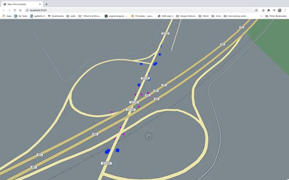
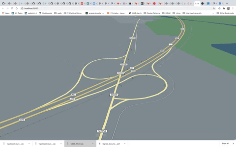
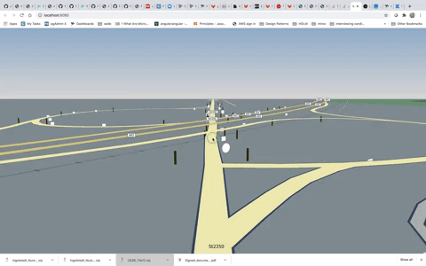

# Rendering intermediate map features: localization objects - signs and poles
In this example, we render map features such as signs and poles. 

This is a sample dataset, which is generated after machine learning algorithms detect map features (such as signs and poles) from 2D images.
The location of these features is extracted by fusing Lidar point cloud with 2D images (Lidar point to camera pixel projection).

While Lidar data helps to provide accuracy, car sensor data self-heals the map and ensures freshness.

## Section 1: Visualize poles and signs JSON data in 2D

Json Files with poles and signs data are available under ./intermediate/initial/resources
This data is in GeoJSON format and can be previewed on http://geojson.tools/index.html

### Update Map Location

This data lies in Western Europe in Munich and therefore we will position our map in Munich

#### index.ts

```
// center the camera to Munich by setting coordinates as mentioned below
mapView.lookAt({
    target: new GeoCoordinates(48.33360593898094, 11.699101776097852),
    distance: 1500,
    zoomLevel: 18,
    tilt: 40
});
```

### Add data-driven styling for poles and signs

#### View.ts

```
const mapView = new MapView({
    canvas: this.canvas,
    decoderUrl: 'decoder.bundle.js',
    theme: {
        extends: 'resources/berlin_tilezen_base.json',
        // Data driven styling : https://developer.here.com/tutorials/harpgl/#data-driven-styling
        styles: {
            poles: [
                {
                    when: ['==', ['geometry-type'], 'Point'],
                    technique: 'circles',
                    color: '#ff00ff',
                    size: 20
                }
                ],
            signs: [
                {
                    when: ['==', ['geometry-type'], 'Point'],
                    technique: 'squares',
                    color: '#ff00ff',
                    size: 20
                }
                ]
            }
    }
});
```

### Add a data source for poles to the map 

#### Create DataSource for poles

This includes creating a datasource provider which uses the poles.json file.
[VectorTileDataSource](https://www.harp.gl/docs/master/doc/modules/harp_vectortile_datasource.html) uses the provider and sets the styleset as defined above.

```
const geoJsonDataPolesProvider = new GeoJsonDataProvider(
    'poles',
    new URL('resources/poles.json', window.location.href),
    { workerTilerUrl: 'decoder.bundle.js'});

const polesDataSource = new VectorTileDataSource({
    dataProvider: geoJsonDataPolesProvider,
    name: 'poles',
    styleSetName: 'poles',
    concurrentDecoderScriptUrl: 'decoder.bundle.js'
    });

    mapView.addDataSource(polesDataSource);
    polesDataSource.enabled = true;
```

#### See poles data rendering

If the app is not already running, execute `npm start`.
Zoom in and see the poles data being rendered in 2D as simple circles.

#### Create datasource for signs

```
const geoJsonDataSignsProvider = new GeoJsonDataProvider('poles',
    new URL("resources/signs.json", window.location.href),
    {workerTilerUrl: 'decoder.bundle.js'});

const signsDataSource = new VectorTileDataSource({
    dataProvider: geoJsonDataSignsProvider,
    name: 'signs',
    styleSetName: 'signs',
    concurrentDecoderScriptUrl: 'decoder.bundle.js'});

mapView.addDataSource(signsDataSource);
signsDataSource.enabled = true;
```

#### See signs data rendering

You can now see signs and poles in 2D as below



### Section 2: Visualize poles and signs data in 3D

#### Set Map tilt to 85 degrees

##### index.ts

```
const harpMapControls = new MapControls(mapView);
harpMapControls.maxTiltAngle = 85;
```

#### Remove Signs and Poles Datasources

##### View.ts

Comment out the signs and poles datasource code as shown below:

```
/*
const geoJsonDataPolesProvider = new GeoJsonDataProvider(
    'poles',
    new URL('resources/poles.json', window.location.href),
    {
        workerTilerUrl: 'decoder.bundle.js'
    }
);
const polesDataSource = new VectorTileDataSource({
    dataProvider: geoJsonDataPolesProvider,
    name: 'poles',
    styleSetName: 'poles',
    concurrentDecoderScriptUrl: 'decoder.bundle.js'
});

mapView.addDataSource(polesDataSource);
polesDataSource.enabled = true;

const geoJsonDataSignsProvider = new GeoJsonDataProvider(
    'poles',
    new URL("resources/signs.json", window.location.href),
    {
        workerTilerUrl: 'decoder.bundle.js'
    }
);

const signsDataSource = new VectorTileDataSource({
    dataProvider: geoJsonDataSignsProvider,
    name: 'signs',
    styleSetName: 'signs',
    concurrentDecoderScriptUrl: 'decoder.bundle.js'
});

mapView.addDataSource(signsDataSource);
signsDataSource.enabled = true;*/
```

#### Creation of 3D Pole Objects

Add the following import to be able to use THREE.

##### View.ts

```
import * as THREE from "three";
import {MapAnchor} from '@here/harp-mapview';
import {GeoCoordinates} from "@here/harp-geoutils";

```

Add the following method for creation of 3D objects for a pole feature.

[Object3D](https://threejs.org/docs/#api/en/core/Object3D) is the base class for most objects in three.js and provides a set of properties and methods for manipulating objects in 3D space.

In the method below, we create a Mesh for the pole with [CylinderGeometry](https://threejs.org/docs/#api/en/geometries/CylinderGeometry) and [MeshStandardMaterial](https://threejs.org/docs/#api/en/materials/MeshStandardMaterial)
Before adding the geometry to the Mesh, it is rotated by 90 degrees and scaled down.

Since harp.gl is built upon three.js, you can add any 3D object to the map scene, just like you would with any other three.js scene.

For more information on three.js scenes and objects, please take a look at the [three.js manual](https://threejs.org/docs/index.html#manual/en/introduction/Creating-a-scene)


```
protected createPole(topDiameter, bottomDiameter): MapAnchor<THREE.Object3D> {
    const pole = new THREE.Object3D();

    var cylinderGeometry = new THREE.CylinderGeometry(
        topDiameter / 2,
        bottomDiameter / 2,
        60, // height
        50 // radialSegments
    );
    var material = new THREE.MeshStandardMaterial({
        color: 0xffff00,
        metalness: 1,
        roughness: 1
    });

    cylinderGeometry.rotateX((90 * Math.PI) / 180);
    cylinderGeometry.scale(0.1, 0.1, 0.1);

    var cylinder = new THREE.Mesh(cylinderGeometry, material);

    pole.add(cylinder);
    return pole;
}
```

#### Add 3D poles to the map

Here we iterate through poles data and create a 3D object for each.
The objects are then added as a [MapAnchor](https://www.harp.gl/docs/master/doc/modules/harp_mapview.html#mapanchor-1) to the map.

```
fetch("./resources/poles.json")
    .then(response => {
        if (response.status === 200) {
            return response.json();
        } else {
            return Promise.reject(response);
        }
    })
    .then(polesData => {
        // iterate through poles data
        polesData.features.forEach(poleFeature => {
            // Create a 3d Pole using dimensions
            const pole3DObject = this.createPole(
                poleFeature.properties.topCrossSectionDiameterCm.dimensionCm / 2,
                poleFeature.properties.bottomCrossSectionDiameterCm.dimensionCm / 2
            );

            const geoCoordinate = new GeoCoordinates(
                poleFeature.geometry.coordinates[1],
                poleFeature.geometry.coordinates[0],
                0
            );

            pole3DObject.anchor = geoCoordinate;

            // Add pole to the map anchors
            mapView.mapAnchors.add(pole3DObject);
        });
    });
```

#### Check poles rendering on the map

Pan and tilt the map to see these objects


#### Visualize signs data

Incase of signs, we have rectangular as well as circular signs.
Both these shapes will be created differently. 

Rectangle: [ExtrudeBufferGeometry](https://threejs.org/docs/#api/en/geometries/ExtrudeBufferGeometry)

Circle: [CylinderBufferGeometry](https://threejs.org/docs/#api/en/geometries/CylinderBufferGeometry)

Please add the three methods below:

##### View.ts

```
protected createSignShape(signShape, width, height, angle) {
        if (signShape === 'RECTANGLE') {
            return this.createRectangularSign(width, height, angle);
        } else if (signShape === 'CIRCLE') {
            return this.createCircularSign(width, height, angle);
        }
    }

    // Create shape of rectangular sign
    protected createRectangularSign(width, height, angle): MapAnchor<THREE.Object3D> {
        const sign = new THREE.Object3D();

        const shape = new THREE.Shape();
        const x = width / 100;
        const y = height / 100;
        shape.moveTo(x, y);
        shape.lineTo(-x, y);
        shape.lineTo(-x, -y);
        shape.lineTo(x, -y);
        let extrudeSettings = {
            steps: 2,
            depth: 1,
            bevelEnabled: true,
            bevelThickness: 3,
            bevelSize: 2,
            bevelOffset: 5,
            bevelSegments: 6
        };
        let xRotation = (90 * Math.PI) / 180;
        let zRotation = -(angle * Math.PI) / 180;

        const extrudedGeometry = new THREE.ExtrudeBufferGeometry(shape, extrudeSettings);
        extrudedGeometry.rotateX(xRotation);
        extrudedGeometry.rotateZ(zRotation);

        var material = new THREE.MeshStandardMaterial({ color: 0xffffff });

        extrudedGeometry.scale(0.1, 0.1, 0.1);
        var box = new THREE.Mesh(extrudedGeometry, material);

        sign.add(box);

        return sign;
    }

    // Create shape of a circular sign
    protected createCircularSign(width, height, angle): MapAnchor<THREE.Object3D> {
        const sign = new THREE.Object3D();
        const cylinderBufferGeometry = new THREE.CylinderBufferGeometry(
            width / 10,
            width / 10,
            0.6,
            15,
            1,
            false,
            0,
            6.3
        );
        let zRotation = -(angle * Math.PI) / 180;

        cylinderBufferGeometry.rotateZ(zRotation);

        cylinderBufferGeometry.scale(0.1, 0.1, 0.1);

        var material = new THREE.MeshBasicMaterial({ color: 0xffffff });
        var box = new THREE.Mesh(cylinderBufferGeometry, material);

        sign.add(box);

        return sign;
    }
```

#### Add signs data to the map

##### View.ts

In the initialize method, add the following to iterate through signs data
And then add the 3D objects to the map 

```
fetch("./resources/signs.json")
            .then(response => {
                if (response.status === 200) {
                    return response.json();
                } else {
                    return Promise.reject(response);
                }
            })
            .then(signsData => {
                // Iterate through signs data
                signsData.features.forEach(signFeature => {
                    const geoCoordinate = new GeoCoordinates(
                        signFeature.geometry.coordinates[1],
                        signFeature.geometry.coordinates[0],
                        0
                    );

                    if (signFeature.properties && signFeature.properties.shape) {
                        // Create a 3d object
                        const sign3DObject = this.createSignShape(
                            signFeature.properties.shape.shape,
                            signFeature.properties.widthCm.dimensionCm,
                            signFeature.properties.heightCm.dimensionCm,
                            signFeature.properties.heading.angle
                        );

                        if (sign3DObject) {
                            sign3DObject.anchor = geoCoordinate;
                        }

                        // add it to the map anchors
                        mapView.mapAnchors.add(sign3DObject);
                    }
                });

            });
````
#### See poles and signs rendering as below

